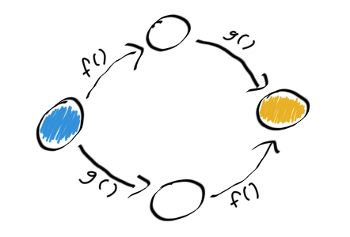

- title : Intro to Property Based Testing
- description : An introduction to property based testing.
- author : Shane Charles
- theme : night
- transition : default

***

### Intro to Property Based Testing

***

### Thank You

***
<!-- .slide: class="two-floating-elements" -->
### About me

    <ul>
     <li>Shane Charles</li>
<li>White Light Computing, Inc.</li>
<li>Functional programming enthusiast</li>
<li>Board member for Winnipeg .Net UG</li>
</ul>

    type ContactType = | Twitter | Blog | GitHub

    let getContactInfo = function
      | Twitter -> "@dead_stroke"
      | Blog    -> "http://geekeh.com"
      | GitHub  -> "shanecharles"

***

### What is property based testing?

> The thing that QuickCheck does. 
>
> ~ almost everybody

---

### Not Quite

    [lang=C#]
    public class SomeClass 
    {
        public string PropertyToTest { get; set; }
    }

---

### Merriam-Webster Definition of Property

- a quality or trait belonging and especially peculiar to an individual or thing
- an attribute common to all members of a class 

---

### Property Based Testing

A trait belonging to a process with results common to all members of a set of inputs.

---

### Example

Any positive number multiplied by negative one will have a result less than zero.

- Process: `(*) -1`
- Input Set: `Choose [1 .. ]`
- Result: `< 0`

***

### We Already Have TDD

- unit tests
- integration tests

---
### Test, Fail, Fix

---

### Test, Fail, Fix

---

### The Power of TDD

- Build code one failure at a time
- Growth with stability
- Regression checks

---

### TDD has Limits

- Testing through specific examples
 - How many is enough?
- Active becomes passive testing
- Legacy code with no tests

---

### Property Advantages

- Generative testing 
- Always active testing
- Generate actions or commands
- Race conditions

***

### Where to start

- Get a chunk of code or a library you commonly use
 - Don't start with nothing (this isn't TDD)

---

##### Find your Testing Library

[http://hypothesis.works/articles/quickcheck-in-every-language/](http://hypothesis.works/articles/quickcheck-in-every-language/)

---

### Make Some Assumptions

What do you think is true about the code or process?

---

### Generate inputs

---

### Question Everything

- Is it an actual failure or a problem with property?

> Properties can require a lot of thought and can be difficult to come up with.

***

### Patterns for Properties

- Starting point for creating properties

---

### There and Back

- Serialization and deserialization
- Set value and get value

---

### Different Paths Same Destination

- x + y = y + x
- x + x = x * 2

---

### Some Things Never Change

- Size of collection
- elements of a collection after a sort

---

### Hard to Prove Easy to Verify

- String tokenizer
 - Verify by concatenating the tokens
- Sorting

---

### Test Oracle

- Compare your results to a different 'proven' solution
  - Performance optimizations

---

### Should not crash

- Generate http requests
 - Get, Post, etc.
 - Accepted HttpStatuses

***

### Model Based Testing

Represent a complex system with a simplified model.

---

### Command and Compare

- Generate sequence of commands
- Commands executed on model and the system
- Compare the intermediate results

---

### Divergence Problems

- System under test
- Model
- Both above
- Specification

---

### Benefits

- Understanding of system
- Identify specification deficiencies
- Parallel execution for race conditions
- Shrinking provides regression tests

***

### Summary

- Coming up with Properties can be difficult
 - Forces us to better understand the domain
- Not meant for building
- The more complex the problem the better
- Model based testing
 - Simplified representation of all or parts

---

### Use Both

#### Unit Test

#### Property Based Test

***

### Extra Resources

- F# for Fun and Profit 
 - https://fsharpforfunandprofit.com/posts/property-based-testing/
- Testing the Hard Stuff and Staying Sane by John Hughes
 - https://www.youtube.com/watch?v=zi0rHwfiX1Q
- PropEr Testing
 - https://propertesting.com
- Hypothesis
 - https://hypothesis.readthedocs.io

***
